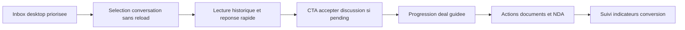
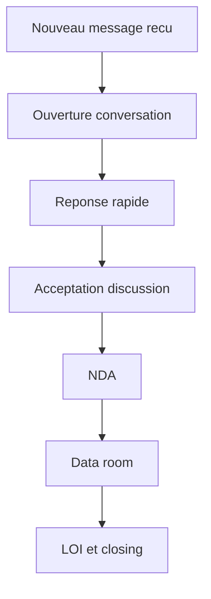

# Plan détaillé de refonte ergonomique messagerie desktop first

## 1. Objectif produit et périmètre

### Objectif principal
Optimiser la messagerie pour usage desktop prioritaire avec trois résultats mesurables
- lecture plus rapide de l inbox
- réponse plus fluide sans rupture visuelle
- meilleure progression du tunnel discussion vers deal

### Contraintes de mise en oeuvre
- conserver les données et services Supabase existants
- ne pas casser les parcours blocage archivage filtres non lus et pending
- garder compatibilité mobile avec adaptation secondaire

## 2. Audit ciblé de l existant

Références principales
- src/pages/Messages.jsx
- src/services/messageService.js
- src/services/conversationService.js
- src/components/messages/DealStageManager.jsx
- src/components/messages/DocumentVault.jsx

### Frictions UX identifiées
1. Changement de conversation couplé à navigation forcée URL complète
2. Densité du tableau desktop élevée et hiérarchie visuelle insuffisante
3. CTA métier critiques peu saillants quand conversation pending
4. Trop de signaux concurrents dans le panneau droit deal et documents
5. Saisie de message correcte mais expérience altérée par rechargement après envoi

### Frictions techniques identifiées
1. Double état messages et allMessages avec risque de divergence
2. Rechargement complet de messages après send
3. Coût de rendu sur listes filtrées recalculées à chaque interaction
4. Couplage fort logique métier et rendu UI dans un seul composant volumineux

## 3. Workflow cible desktop first

### Règles de comportement
- un clic conversation doit mettre à jour l état local avant synchronisation URL
- la colonne centrale conversation est la zone primaire de valeur
- la colonne droite affiche uniquement actions de prochaine étape et informations utiles
- toute action critique doit avoir un feedback immédiat visuel

## 4. Conception détaillée UX desktop

## 4.1 Vue inbox desktop

### Structure visuelle cible
Tableau en huit colonnes conservé mais réordonné par priorité métier
1. Date activité
2. Demandeur
3. Sujet message
4. Annonce
5. Type
6. Non lus
7. Statut réponse
8. Actions

### Ajustements ergonomiques
- renforcer contraste de la ligne active
- limiter à une ligne le texte secondaire avec ellipsis
- afficher badge pending avec tonalité unique et stable
- afficher badge non lu uniquement si supérieur à zero
- action archiver visible mais secondaire

### Tri et filtres
- tri par activité récente par défaut
- filtres all unread pending archived conservés
- recherche texte appliquée sur annonce et demandeur

### Détails interaction
- clic ligne ouvre conversation sans flash page
- Enter sur ligne active ouvre conversation
- action archiver exécute sans ouvrir la conversation

## 4.2 Vue conversation desktop

### Architecture en trois zones
- zone gauche inbox compacte optionnelle en desktop large
- zone centrale messages et saisie
- zone droite contexte deal et documents

### Header conversation
- titre annonce cliquable
- identité contact synthétique
- bouton bloquer en action de sécurité mais visuellement secondaire

### Corps messages
- historique paginé avec charger plus en haut
- bulles homogènes et alignement stable
- horodatage lisible et confirmation de lecture discrète
- indicateur typing conservé avec bruit visuel réduit

### Zone saisie
- input sticky bas de viewport
- compteur caractères discret
- erreurs envoi et anti bypass affichées sans modal intrusive
- envoi clavier Enter avec Shift Enter pour saut de ligne

## 4.3 Panneau droit deal et documents

### Priorisation fonctionnelle
Ordre cible
1. Avancement deal et prochaine action
2. Etat NDA
3. Documents récents
4. Informations annonce et contact

### Règles CTA
- pending vendeur: CTA accepter discussion prioritaire
- étape nda: CTA signer NDA prioritaire
- étape data_room: CTA partager document pour vendeur
- chaque CTA doit afficher état loading local

## 5. Optimisations performance front

## 5.1 Gestion état messages
- source de vérité unique messages
- retirer allMessages ou le transformer en cache dérivé memoïsé
- update optimiste lors de send puis réconciliation realtime

## 5.2 Temps réel et subscriptions
- un seul abonnement insert et un update par conversation active
- nettoyage strict au changement conversation
- pas de duplication de messages par id

## 5.3 Rendu et calculs
- memo pour filteredConversations
- extraire ligne conversation en composant dédié pour réduire rerenders
- limiter recalcul des labels profil et format date

## 5.4 Navigation interne
- remplacer window.location.href par navigation contrôlée route state
- conserver query conversation pour partage URL mais sans reload complet

## 6. Optimisations conversion

### Tunnel cible

### Leviers prioritaires
- réduire délai premier retour via mise en avant conversations non lues
- rendre évident le prochain pas deal dans le panneau droit
- maintenir contexte annonce visible pour réduire hésitation réponse

## 7. Instrumentation KPI

Evénements à tracer
- message_inbox_opened
- message_conversation_opened
- message_sent
- conversation_accepted
- deal_stage_changed
- document_shared

KPI produit
- taux ouverture inbox vers conversation
- délai premier message reçu vers première réponse
- taux pending vers accepted
- taux progression par étape deal
- taux partage document après passage data_room

## 8. Backlog technique par phases

## Phase A Desktop UX foundation

Tâches
- refactor header inbox et lignes tableau dans src/pages/Messages.jsx
- normaliser badges et statuts dans la liste
- améliorer hiérarchie visuelle conversation

Critères acceptation
- lisibilité inbox augmentée sans perte info métier
- action primaire identifiable en moins de deux secondes

## Phase B Fluidité et performance

Tâches
- unifier état messages dans src/pages/Messages.jsx
- adapter src/services/messageService.js pour flux pagination cohérent
- optimiser subscriptions dans src/services/conversationService.js et page

Critères acceptation
- plus de reload complet après envoi
- message visible instantanément puis confirmé realtime

## Phase C Conversion deal documents

Tâches
- simplifier microcopy et CTA dans src/components/messages/DealStageManager.jsx
- simplifier affichage et action document dans src/components/messages/DocumentVault.jsx
- prioriser CTA selon rôle et étape

Critères acceptation
- augmentation des actions acceptation et progression deal
- baisse des abandons après premier échange

## Phase D Mesure et stabilisation

Tâches
- instrumentation événements UI dans src/pages/Messages.jsx
- vérification KPI et ajustements mineurs ergonomiques

Critères acceptation
- données exploitables disponibles pour arbitrage produit
- stabilité fonctionnelle validée sur parcours principaux

## 9. Stratégie de test

### Tests fonctionnels
- ouverture conversation depuis inbox desktop
- envoi message et réception temps réel
- archivage blocage filtres recherche
- pending vers accepted
- deal stage et documents

### Tests UX
- scan visuel tableau en lecture rapide
- parcours clavier minimal desktop
- contrôle charge cognitive dans panneau droit

### Tests non régression
- mobile conserve fonctionnement actuel
- services notifications email restent non bloquants

## 10. Fichiers cibles implementation

- src/pages/Messages.jsx
- src/services/messageService.js
- src/services/conversationService.js
- src/components/messages/DealStageManager.jsx
- src/components/messages/DocumentVault.jsx
- plans/messagerie-optimisation-plan.md
