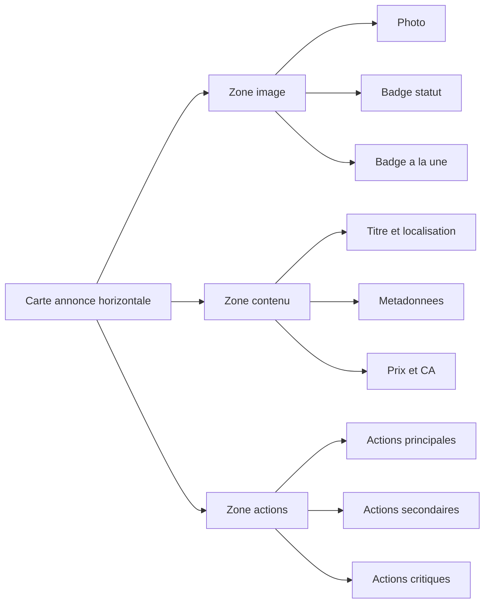

# Plan de refonte UX UI - MyListings

## Portée validée
- La refonte cible uniquement les cartes de la page MyListings
- Objectif prioritaire : passer les cartes en disposition horizontale pour afficher proprement toutes les actions
- Le bloc de synthèse en haut doit être clarifié et mieux hiérarchisé

## Constat actuel
- Le résumé de tête mélange plusieurs métriques sur des lignes de texte peu différenciées
- Les actions de carte utilisent des couleurs hétérogènes hors charte
- La grille 3 colonnes avec cartes verticales compresse la zone actions
- La lisibilité mobile baisse avec la densité de boutons

## Cible UX

### 1 Bloc de synthèse Mes annonces
Transformer les 3 lignes de stats en 3 cartes KPI alignées visuellement :
- Carte 1 Annonces : total, actives, vues
- Carte 2 Sponsoring : jours disponibles
- Carte 3 Performance sponsoring : actives à la une, activations totales

Bénéfices :
- Lecture instantanée
- Hiérarchie claire
- Meilleure cohérence avec le design system

### 2 Carte annonce horizontale
Passer d un layout vertical à un layout horizontal en 3 zones :
- Zone média gauche : image + badges statut
- Zone contenu centre : titre, localisation, tags, prix et CA
- Zone actions droite : tous les boutons dans une colonne organisée

Comportement responsive :
- Desktop : ligne horizontale complète
- Tablette : contenu conserve 3 zones avec actions compactées
- Mobile : empilement vertical intelligent, actions sur 2 lignes compactes dans la carte

### 3 Système d actions
Conserver toutes les actions visibles dans la carte mais avec hiérarchie visuelle :
- Niveau primaire : action clé selon état annonce
- Niveau secondaire : modifier, voir, dupliquer
- Niveau critique : vendre, supprimer

Règles UI :
- Utiliser les tokens tailwind du projet primary secondary destructive outline
- Uniformiser typo et tailles via Button size sm et variantes
- États normal hover focus disabled loading homogènes

### 4 Micro interactions et feedback
- Loader inline sur action en cours
- Désactivation des actions incompatibles selon statut
- Tooltips explicites pour les cas bloquants
- Messages succès erreur conservés mais harmonisés dans le ton

## Schéma de layout cible

## Stratégie d implémentation

### Fichier principal
- src/pages/MyListings.jsx
  - Recomposer le header KPI en cartes
  - Remplacer la grille de cartes verticales par une liste de cartes horizontales
  - Réorganiser le bloc actions avec hiérarchie visuelle
  - Ajouter classes responsive pour mobile

### Réutilisation design system
- src/components/ui/button.jsx
  - Utiliser prioritairement les variantes existantes
  - Ajouter uniquement si nécessaire une variante supplémentaire dédiée aux actions utilitaires

### Ajustements styles globaux optionnels
- src/index.css
  - Ajouter classes utilitaires minimales seulement si un besoin non couvert apparaît

## Critères d acceptation
- Les cartes de MyListings sont horizontales sur desktop
- Tous les boutons sont lisibles, alignés et cohérents avec la charte
- Le résumé en haut est converti en KPI cards claires
- La version mobile reste lisible sans débordement des actions
- Les états disabled et loading sont explicites
- Aucune régression sur les actions existantes activer retirer a la une, éditer, voir, dupliquer, vendre, supprimer
