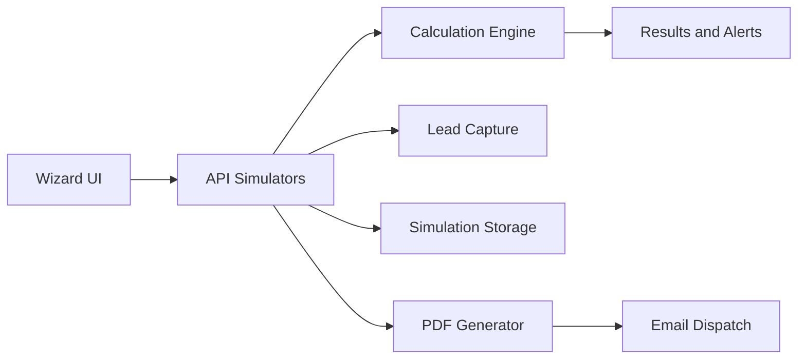

# Plan d’implémentation des outils Acheteur & Vendeur

## 1. Contexte analysé

### Sources fonctionnelles
- `docs/simulators_specs.md`
- `docs/valuation_tool_specs.md`
- `docs/valuation_formulas.md`
- `docs/valuation_ui_maquette.md`
- `docs/valuation_wizard_component.md`
- `docs/deployment.txt`

### État actuel de l’application
- Un calculateur simple existe déjà: `src/components/PriceCalculator.jsx`
- Le formulaire vendeur existe: `src/components/SellerForm.jsx`
- Le formulaire acheteur existe: `src/components/BuyerForm.jsx`
- La page détail annonce exploite déjà les champs financiers acheteur/vendeur: `src/pages/BusinessDetails.jsx`
- Le modèle métier Business actuel ne couvre pas encore les besoins détaillés des 3 simulateurs: `entities/Business`

## 2. Périmètre des outils à implémenter

### Outil A — Simulateur de valorisation vendeur
Objectif: produire une valorisation multi-méthodes avec fourchette et valeur médiane
- Méthodes: Bercy mixte, Multiples, DCF simplifié
- UX: wizard étape par étape + écran résultats 3 cartes
- Gating: capture lead avant déverrouillage complet
- Livrable: PDF d’évaluation préliminaire

### Outil B — Simulateur complet de financement de reprise acheteur
Objectif: qualifier la finançabilité et proposer un montage cible
- Calculs: structure de financement, capacité dette, DSCR, mensualité, cash post-reprise
- Résultat: statut Finançable Sous conditions Risqué
- Livrable: synthèse des hypothèses et alertes

### Outil C — Simulateur net vendeur après impôts
Objectif: estimer le net encaissé après fiscalité et frais
- Calculs: plus-value, PFU versus barème, prélèvements sociaux, abattements, cas retraite
- Résultat: net vendeur, taux effectif, comparaison de scénarios
- Livrable: rapport de scénarios et recommandations

## 3. Architecture cible commune

### Principes de conception
1. Séparer UI, moteurs de calcul et transport API
2. Versionner les formules pour auditabilité
3. Persister les hypothèses utilisées pour chaque résultat
4. Ajouter des disclaimers de non conseil fiscal et financier
5. Instrumenter les étapes pour suivre la complétion et la conversion

## 4. Plan d’implémentation par outil

## 4.1 Outil A — Valorisation vendeur

### Lot A1 — Modèle de données et validations
- Définir tous les inputs requis des étapes 1 à 4 du wizard
- Définir les bornes et validations métier
- Préparer la structure de sortie: borne basse, médiane, haute, diagnostics

### Lot A2 — Moteur de calcul valorisation
- Implémenter retraitements EBE et rémunération normative
- Implémenter moteur Rendement et DCF
- Implémenter moteur Multiples sectoriels avec modificateurs qualité
- Implémenter moteur Bercy et conversion Enterprise Value vers Equity Value
- Générer un résultat final harmonisé et explicable

### Lot A3 — UI wizard valorisation
- Créer structure composant wizard parent plus steps
- Intégrer navigation, progression, validation, écran loading
- Construire écran résultats 3 cartes avec version partiellement masquée

### Lot A4 — Lead gating et PDF
- Capturer prénom nom email pro consentement RGPD
- Débloquer résultats complets après soumission valide
- Générer PDF et déclencher envoi email

### Lot A5 — Tests et conformité
- Jeux de tests unitaires de formules
- Tests d’intégration API
- Vérification cohérence des fourchettes et messages d’alerte

## 4.2 Outil B — Financement de reprise acheteur

### Objectif consolidé
- Déterminer si un projet de reprise est finançable
- Proposer un montage optimal et explicable

### Cibles utilisateurs
- Repreneur individuel
- Entrepreneur externe
- Manager en reprise MBI MBO
- Investisseur

### Lot B1 — Modèle de données d’entrée et validations

#### Bloc B1A — Informations sur la cible
- Prix d’acquisition envisagé en euros
- Chiffre d’affaires
- EBITDA ou résultat d’exploitation
- Résultat net
- Dettes existantes
- BFR
- Investissements futurs estimés
- Secteur d’activité
- Nombre de salariés

#### Bloc B1B — Profil du repreneur
- Apport personnel
- Patrimoine mobilisable
- Revenus actuels
- Situation professionnelle
- Expérience secteur oui non
- Associés ou investisseurs
- Garantie personnelle possible

#### Bloc B1C — Paramètres de financement
- Durée du prêt
- Taux d’intérêt estimé
- Crédit vendeur pourcentage
- Earn-out
- Subventions et aides
- Holding de reprise oui non

### Lot B2 — Moteur de calcul financement
- Répartition de financement: apport, dette bancaire, crédit vendeur, mezzanine, investisseurs, aides
- Capacité d’endettement: dette cible approximative entre 3 et 5 fois EBITDA
- Calcul DSCR ratio de couverture de dette
- Calcul mensualités via formule standard emprunt montant durée taux
- Cash flow post reprise: EBITDA moins remboursement dette moins impôts moins investissements moins rémunération dirigeant

### Lot B3 — Indicateurs et décision
- Apport minimum recommandé
- Dette maximale supportable
- DSCR
- ROI estimé
- Salaire possible
- Délai remboursement
- Statut final: Finançable, Sous conditions, Risqué

### Lot B4 — Alertes métier
- Apport insuffisant
- Rentabilité trop faible
- Risque bancaire
- Dette excessive
- Salaire non viable

### Lot B5 — Restitution UI et livrables
- Écran de résultats avec montage recommandé détaillé
- Affichage mensualité et cash disponible annuel
- Export PDF optionnel avec montage détaillé, hypothèses, analyse de faisabilité, recommandations
- Respect strict de la charte graphique existante de l’application

### Lot B6 — Tests
- Cas limites EBITDA faible, apport insuffisant, dette excessive
- Vérifier cohérence statuts Finançable Sous conditions Risqué
- Vérifier robustesse des alertes selon variations de taux, durée, apport

## 4.3 Outil C — Net vendeur après impôts

### Objectif consolidé
- Calculer le montant réellement perçu par le cédant après fiscalité et frais

### Cibles utilisateurs
- Dirigeant actionnaire
- Fondateur
- Associé sortant
- PME TPE

### Lot C1 — Modèle de données d’entrée et validations

#### Bloc C1A — Informations sur la vente
- Prix de cession en euros
- Type de cession titres ou fonds
- Frais de cession en euros ou pourcentage
- Dettes remboursées

#### Bloc C1B — Données fiscales
- Prix d’acquisition initial
- Apports réalisés
- Durée de détention
- Date de création entreprise

#### Bloc C1C — Situation personnelle
- Âge
- Départ retraite prévu oui non
- Résidence fiscale
- Situation matrimoniale optionnelle
- Tranche d’imposition

#### Bloc C1D — Paramètres juridiques
- Détention directe ou via holding
- Abattements applicables
- Régime fiscal PFU flat tax ou barème progressif

### Lot C2 — Moteur de calcul fiscal
- Plus value brute: prix de vente moins prix acquisition moins frais déductibles
- Fiscalité: PFU ou barème, prélèvements sociaux, abattements, exonération retraite éventuelle
- Impôt total: impôt sur le revenu plus prélèvements sociaux
- Net perçu: prix de vente moins impôts moins frais moins dettes

### Lot C3 — Scénarios comparatifs
- Scénario flat tax
- Scénario barème progressif
- Scénario départ retraite

### Lot C4 — Résultats et alertes
- Net vendeur estimé principal
- Plus value imposable
- Taux d’imposition effectif
- Impôts totaux
- Frais
- Montant final encaissé
- Alertes: optimisation fiscale possible, vente via holding à étudier, départ retraite à anticiper, risque de sur imposition

### Lot C5 — Restitution UI et livrables
- Dashboard net vendeur lisible avec comparaison de scénarios
- Rapport PDF recommandé avec détail calcul, hypothèses, scénarios alternatifs, conseils d’optimisation
- Respect strict de la charte graphique existante de l’application

### Lot C6 — Tests
- Vérifier exactitude des formules sur cas de référence
- Tester robustesse des scénarios comparatifs
- Vérifier cohérence des alertes et du taux effectif affiché

## 5. Travaux transverses communs

### Données et backend
- Créer schémas de persistance simulations
- Concevoir endpoints calcul, sauvegarde, PDF, email
- Ajouter version de formule et hash d’entrée pour audit

### UX et produit
- Uniformiser composants, stepper, états erreur, accessibilité
- Ajouter microcopies de confiance et mentions RGPD
- Prévoir expérience mobile-first
- Exiger la conformité stricte à la charte existante pour les simulateurs acheteur et vendeur
- Réutiliser les composants design system déjà en place au lieu de créer une nouvelle grammaire visuelle
- Utiliser les tokens de couleur et de typographie déjà présents dans l’application pour boutons, cartes, badges et titres
- Définir une checklist UI de conformité avant merge pour vérifier couleurs, fontes, tailles, états hover et contrastes
- Prévoir un mode sombre uniquement si cohérent avec la charte active, sinon rester sur le thème applicatif actuel
- Vérifier visuellement les écrans des simulateurs sur desktop et mobile pour garantir homogénéité avec les pages existantes

### Suivi business
- Événements de tracking: start step complete result view lead submit pdf sent
- Tableaux de bord: taux de complétion par étape, taux de déblocage, abandon

## 6. Intégration dans l’existant

- Réutiliser la base visuelle de `src/components/PriceCalculator.jsx` comme point de départ UI
- Connecter simulateur valorisation au parcours vendeur depuis `src/components/SellerForm.jsx`
- Connecter simulateur financement au parcours acheteur depuis `src/components/BuyerForm.jsx`
- Ajouter accès simulateurs depuis les vues pertinentes de `src/pages/BusinessDetails.jsx`
- Conserver compatibilité avec schéma Business existant sans casser les annonces en production

## 7. Gouvernance de livraison

## Phase 1
- Fondations techniques communes
- Modèles de données
- API de calcul minimales

## Phase 2
- Outil A complet
- Validation fonctionnelle métier

## Phase 3
- Outil B complet
- Validation statuts finançabilité

## Phase 4
- Outil C complet
- Validation fiscale comparée

## Phase 5
- PDF, email, analytics, durcissement qualité
- Préparation mise en production progressive

## 8. Critères d’acceptation

- Chaque outil fournit un résultat explicable, reproductible et sauvegardé
- Les hypothèses sont visibles et exportables
- Les alertes métier sont cohérentes avec les entrées
- Les tests unitaires et intégration couvrent les formules critiques
- Le parcours UI reste fluide sur desktop et mobile
- Le gating lead fonctionne avec consentement et traçabilité
