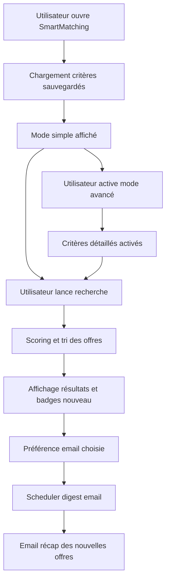

# Plan Smart Matching - Workflow et fonctionnalités

## Objectif produit
Créer une interface Smart Matching unique qui permet à l utilisateur de:
- définir ses critères de recherche à partir des champs cession et acquisition
- lancer des recherches manuelles quotidiennes dans l interface
- recevoir un récap email selon une fréquence choisie: quotidien, hebdomadaire, désactivé

## Décisions produit validées
- Le Smart Matching doit croiser les informations issues des deux formulaires:
  - annonces cession
  - annonces acquisition
- Dans Notification Smart Matching:
  - supprimer le champ Nombre max de matchs par email
  - autoriser la multi sélection des secteurs
  - autoriser la multi sélection des localisations via autocomplete
- Pour le profil Cabinet, renommer les blocs:
  - Annonces Acquisition
  - Annonces Cession
- Mapping métier spécifique:
  - buyer_profile_type doit être configuré dans le bloc Annonces Acquisition et aligné sur le champ Type de profil du formulaire acquisition
  - business_type_sought n existe pas en cession actuellement et doit être ajouté dans le formulaire cession à côté du champ reason_for_sale

## Périmètre fonctionnel MVP

### 0. Favoris dans résultats Smart Matching
- Ajouter un bouton Favori directement dans chaque carte résultat réel
- Réutiliser [`favoriteService.toggleFavorite()`](src/services/favoriteService.js:113)
- Exclure explicitement les cartes Aperçu mock de cette action
- Si utilisateur non connecté: redirection login
- Retour visuel instantané: état favori actif inactif dans la carte

### 1. Interface Smart Matching progressive
- Interface unique Notification Smart Matching avec un seul sélecteur de profil
  - Acheteur
  - Vendeur
  - Cabinet acheteur vendeur
- Jeux de critères distincts par profil
  - Acheteur
    - secteurs via dropdown multi sélection
    - localisations via autocomplete multi sélection
    - budget min max
    - effectifs min max
    - année min max
    - CA min max
    - EBITDA min max
    - type de profil acquéreur
    - type de cession recherchée
  - Vendeur
    - secteurs acquéreur recherchés via dropdown multi sélection
    - localisations cibles via autocomplete multi sélection
    - budget acheteur min max
    - investissement disponible
    - effectifs cibles min max
    - CA cible min max
    - type de cession côté vendeur ajouté dans le formulaire cession
  - Cabinet
    - configuration de deux blocs indépendants acheteur et vendeur dans le même écran
    - libellés affichés:
      - Annonces Acquisition
      - Annonces Cession
- Aucun champ score exposé à l utilisateur
- Ajouter une infobulle sur chaque bloc critère et chaque réglage de notification

### 2. Recherche manuelle quotidienne
- Recherche depuis l interface Smart Matching
- Résultats triables
- Sauvegarde persistante des critères par utilisateur et par mode
- Distinction des matchs nouveaux vs déjà vus

### 3. Alertes email configurables
- Préférence utilisateur dans Smart Matching
  - quotidien
  - hebdomadaire
  - désactivé
- Nouvelle interface dédiée dans Paramètres
  - onglet Notification Smart Matching dans [`Settings`](src/pages/Settings.jsx)
  - UI simple ergonomique conforme à la charte graphique actuelle
  - composants cohérents avec le design system existant
- Raccourci lecture seule dans [`Profile`](src/pages/Profile.jsx) avec état courant et lien vers Smart Matching
- Champs configurables notifications
  - statut alertes activé désactivé
  - fréquence quotidien ou hebdomadaire
  - aucun champ score utilisateur
  - aucun champ nombre max de matchs par email
- Règles métier strictes
  - scoring produit appliqué entre 60% et 100%
  - si aucun nouveau match compatible alors aucun email envoyé
- Phrase produit à afficher dans l interface
  - Aucun email ne sera envoyé quand aucun nouveau match ne correspond à vos critères.
- Nudge post achat
  - dès activation produit smart_matching afficher un tooltip dans Notification Smart Matching
  - message guidant l utilisateur vers la configuration immédiate des alertes
- Logs et idempotence pour éviter les doublons

### 5. Recherche manuelle quotidienne
- Recherche depuis l interface Smart Matching
- Résultats triables
- Sauvegarde persistante des critères par utilisateur et par mode
- Distinction des matchs nouveaux vs déjà vus

## Mapping canonique critères vers données formulaires

### Cession ciblée par acheteur
- secteur -> businesses.sector
- localisation -> businesses.location, businesses.region, businesses.country
- budget -> businesses.asking_price
- effectifs -> businesses.employees
- année -> businesses.year_founded
- CA -> businesses.annual_revenue
- EBITDA -> businesses.ebitda

### Acquisition ciblée par vendeur
- budget acheteur -> businesses.buyer_budget_min, businesses.buyer_budget_max, businesses.buyer_investment_available
- secteurs intéressés -> businesses.buyer_sectors_interested
- localisations cibles -> businesses.buyer_locations
- effectifs cibles -> businesses.buyer_employees_min, businesses.buyer_employees_max
- CA cible -> businesses.buyer_revenue_min, businesses.buyer_revenue_max
- type de profil acquéreur -> businesses.buyer_profile_type

### Cession ciblée par vendeur
- secteur de cession -> businesses.sector
- localisation cession -> businesses.location, businesses.department, businesses.region, businesses.country
- type de cession vendeur -> champ à ajouter dans le formulaire cession près de reason_for_sale
- raison de la vente -> businesses.reason_for_sale

## Data et runtime proposés

### Option recommandée
Conserver les tables existantes et les renforcer:
- smart_matching_criteria
  - ajouter mode, frequency, enabled, min_score, criteria_json, last_search_at, last_digest_sent_at, last_digest_cursor
- smart_matching_scores
  - ajouter score_version, is_new, matched_at, seen_at
- email_dispatch_logs
  - réutiliser pour audit et idempotence des envois digest

### Job email
- Edge Function planifiée qui:
  - charge les utilisateurs avec alertes actives
  - calcule les nouveaux matchs depuis last_digest_cursor
  - envoie un digest avec idempotency_key
  - met à jour last_digest_sent_at et last_digest_cursor

## Workflow cible

## Plan d implémentation par lots

1. SQL et modèle de données
- migration critères enrichis
- migration scores enrichis
- index pour recherche et digest

2. Service Smart Matching
- normalisation critères par mode
- scoring explicable unifié
- marquage new seen

3. UI Smart Matching
- simple puis avancé
- panneau fréquence email
- statut des alertes et dernier envoi

4. Runtime email digest
- edge function digest smart matching
- template email récap
- idempotence et logs

5. QA et validation
- tests rôle acheteur vendeur
- tests fréquence quotidien hebdomadaire désactivé
- tests doublons et non régression UX

## Critères d acceptation
- utilisateur peut rechercher manuellement chaque jour depuis Smart Matching
- utilisateur peut sauvegarder ses critères et les retrouver
- utilisateur peut choisir quotidien hebdomadaire désactivé
- email digest n envoie que les nouvelles offres compatibles
- aucune duplication d email pour une même fenêtre d envoi
